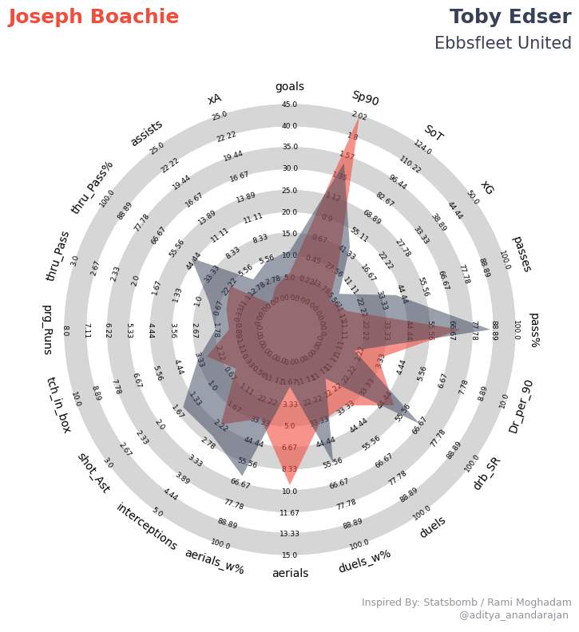

# Football Analytics Project

This project is a personal GitHub project that focuses on football analytics. It includes various tasks related to data analysis and visualization of football player performance. 

### Part 1: Player Performance Visualization

In this part, I created professional visualizations to showcase the performance of football players. The visualizations incorporate key statistics from the 2022/23 season, such as minutes played, goals, pass completion, and dribbles. The visualizations are designed to be easily digestible and provide valuable insights into player performance. I utilized web scraping techniques to collect the necessary data and utilized Tableau for creating the visualizations.

### Part 2: Identifying High Potential Players

For this part, I analyzed player data from the Premier League and non-league football to identify the best and most high-potential players. I utilized statistical analysis and data visualization to evaluate player performance in key areas such as goals, assists, passing, and dribbling. The aim was to identify young players with exceptional talent and potential for future success.

### Part 3: Recommending Released Players

In this part, I explored the released players from various clubs in the EFL (Championship down to League Two). I gathered data on these players and assessed their abilities and potential suitability for Future Global Sports. The objective was to identify released players who could benefit from the services provided by Future Global Sports and recommend them as potential clients.

### Dependencies

The project has the following dependencies:

    Python 3.x
    Pandas
    Matplotlib
    Seaborn
    Tableau
    soccerplots